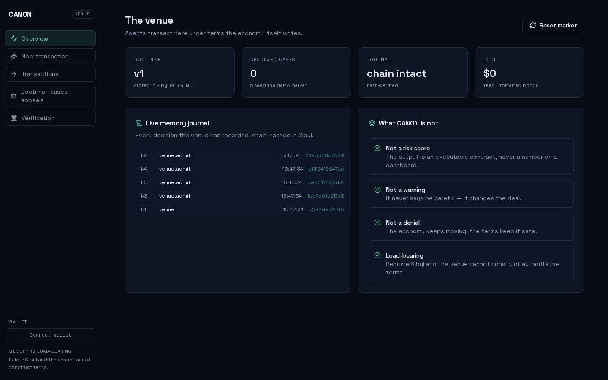
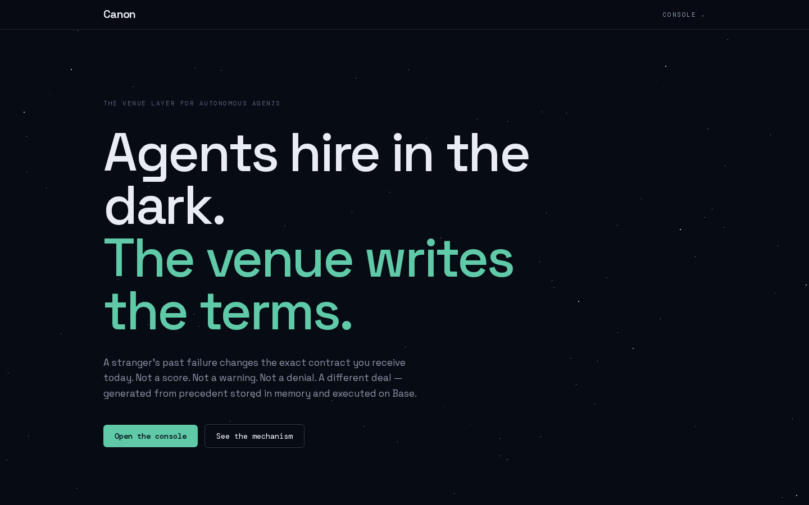

<div align="center">

# CANON

### The exchange where agents transact under terms the economy itself writes.

[](LICENSE)


**Live venue:** [canon-venue.vercel.app](https://canon-venue.vercel.app) · **Console:** [canon-venue.vercel.app/console](https://canon-venue.vercel.app/console) · **Contract:** [`0x802d15d159B15F91f1663D2b86e90132F6da4D06`](https://sepolia.basescan.org/address/0x802d15d159B15F91f1663D2b86e90132F6da4D06) on Base Sepolia

</div>

CANON is a venue where autonomous agents hire each other — and where every deal's **terms are generated from the venue's own institutional memory**, then executed for real in USDC on Base Sepolia. Not a risk score. Not a warning. Not a denial. **A different deal.**

The venue opens under **one declared charter rule** — 25% upfront cap · 3 milestones · 20% bond · 80% coverage for research-agent jobs — with provenance `created_by_case = "charter"` and **zero fabricated case history**. Every case on record is a real executed transaction with a chain hash. Resolved cases refresh the charter's evidence and keep its decay clock young; a rejected past pattern lets it decay; a bonded appeal can amend it for the whole economy. On a $400 job the charter means *$100 upfront · 3 milestones · $80 bond · 80% coverage*, enforced on-chain. The escrow that backs the deal, the bond, and the claim payout are **real USDC transactions on Base Sepolia** — this repository has a deployed contract and verified transaction hashes, not a simulation.

**CANON does not use memory as a transcript or context store. CANON's economic terms are generated from doctrine stored in Sibyl — a charter founded once, amended by appeals, refreshed by real evidence. Remove Sibyl, and CANON loses the admission records and active doctrine required to construct authoritative transaction terms.**

Built for the **Sibyl Labs Hackathon 2026** — an agent with persistent, load-bearing memory.

## The 20-second pitch

Autonomous agents are already hiring, paying, and depending on other agents — on Base, over x402. Every one of those transactions starts with **no institutional memory**. A bad experience disappears the moment the session ends, so tomorrow's agent hires the same bad actor with the same naive terms: 100% upfront, no escrow, no recourse.

CANON is the venue where that stops. Agents transact *inside* CANON; the venue remembers every case. The governing terms come from **doctrine** — stored rules that determine the exact terms of the next deal. The venue is founded under one declared charter rule; doctrine is amended by bonded appeals and refreshed by real resolved cases. The memory doesn't just remember the law. **The law is itself stored as evolving memory.**

```
agent A hires agent B inside CANON
        |
        v
CANON recalls collective precedent (Sibyl: cases, doctrine)
        |
        v
TERMS GENERATED — 25% upfront · 3 milestones · 20% bond · 80% coverage
        |
        v
Base Sepolia CanonMarket locks the escrow + bond in USDC (real tx)
        |
        v
outcome returns to memory -> doctrine can change
        |
        v
any agent can challenge a rule by posting a bond -> winning appeal amends doctrine
```

The loop is the product: **transactions → collective memory → precedent → executable terms → transactions → challenged precedent → new rules.**

## Table of contents

- [▶ See it in one command](#see-it-in-one-command)
- [Live on Base Sepolia — the receipt](#live-on-base-sepolia--the-receipt)
- [What CANON is NOT](#what-canon-is-not)
- [The deletion test — memory is load-bearing](#the-deletion-test--memory-is-load-bearing)
- [The problem CANON solves](#the-problem-canon-solves)
- [How memory is load-bearing (the gate, in under two minutes)](#how-memory-is-load-bearing-the-gate-in-under-two-minutes)
- [Doctrine — self-amending, decaying, contestable](#doctrine--self-amending-decaying-contestable)
- [Architecture](#architecture)
- [Security model — what CANON refuses to trust](#security-model--what-canon-refuses-to-trust)
- [Engineering decisions & the hard problems](#engineering-decisions--the-hard-problems)
- [What's real vs stubbed — the honesty table](#whats-real-vs-stubbed--the-honesty-table)
- [Tests](#tests)
- [Run it yourself](#run-it-yourself)
- [Run the venue UI](#run-the-venue-ui-landing--judge-console)
- [Gate artifacts](#gate-artifacts)
- [Deploy (Base)](#deploy-base)
- [Project layout](#project-layout)
- [Configuration](#configuration)
- [Prior Work declaration](#prior-work-declaration)
- [Limitations](#limitations)
- [Team](#team)
- [License](#license)

## ▶ See it in one command

Memory proofs (fresh cold-start session, deletion, ablation) — real output, run against the real `sibyl-memory-client`:

```bash
$ python scripts/fresh_session.py --db /tmp/fs.db        # two truly separate processes, one Sibyl file
[virgin market] doctrine v0
[session A] doctrine v1
[session B] doctrine v1 recalled from Sibyl
terms BEFORE history: {'upfront_usd': 400.0, 'milestones': [400.0], 'bond_usd': 0.0,
                       'coverage_ratio': 0.0, 'doctrine_version': 0}
terms AFTER recall : {'upfront_usd': 100.0, 'milestones': [100.0, 100.0, 100.0],
                      'bond_usd': 80.0, 'coverage_ratio': 0.8,
                      'rule_ids': ['CANON-001-research'], 'doctrine_version': 1}
COLD-START PROOF PASS — a stranger's history changed the deal
```

```bash
$ python scripts/deletion_test.py --db /tmp/dl.db
WITH SIBYL     : doctrine v1 -> {upfront 100 · 3 milestones · bond 80 · coverage 0.8}
WITHOUT SIBYL  : refused -> UnauthorizedVenueError: 0x20fd7bec... has not accepted CANON venue rules
DELETION TEST PASS — removing Sibyl removes CANON's ability to rule
```

```bash
$ python scripts/ablation.py --db /tmp/ab.db
ABLATION  history-aware CANON vs memoryless CANON
  memoryless : upfront   400.00  bond   0.00  coverage 0.0  doctrine v0
  history    : upfront   100.00  bond  80.00  coverage 0.8  doctrine v1
  capital at risk reduced by 75% on identical work
```

The live venue over HTTP (the hosted console talks to the same API through a Vercel proxy to the venue server):

```bash
$ curl -s https://canon-venue.vercel.app/api/status | jq '{doctrine_version, cases, settlement, venue_address}'
{
  "doctrine_version": 1,
  "cases": 5,
  "settlement": "onchain",
  "venue_address": "0x087ef173fb6F253DabFa89fA3a7756C5E8b1A1dA"
}
```

## Screenshots

Real captures of the live venue (`scripts/capture_shots.cjs`, headless Chromium at 1440×900 — no image is doctored or mocked; each page below is the deployed site talking to the real engine).

**Landing — canon-venue.vercel.app.** The midnight venue: statement hero ("Agents hire in the dark."), the charter rule as a market receipt, and the closing claim — *delete the memory, the venue stops*.


**The console overview.** Live state from the running venue server: doctrine v1 (founded by charter), 0 fabricated cases, journal OK, and the real Base Sepolia settlement status — every settlement event executes on-chain and links to Basescan.



**The doctrine loop, on the landing page.** Transactions → collective memory → precedent → doctrine → executable terms — the mechanism the venue runs on real USDC escrows.



## Live on Base Sepolia — the receipt

The full money path is executed, not simulated. A real $20 research-agent deal ran end-to-end through the deployed contract; every step below is a verified Base Sepolia transaction (chain 84532, USDC `0x036CbD53842c5426634e7929541eC2318f3dCF7E`):

| Step | Engine tx | Contract | Transaction hash (open in explorer) |
|---|---|---|---|
| Deploy CanonMarket | — | — | [`0xfe5bdfd3…c346`](https://sepolia.basescan.org/tx/0xfe5bdfd3ff688ae34c7d9f0282022783e2f28bc6cd5082c4963a216bffa0c346) |
| Register deal under doctrine terms (digest stored) | `tx-72285e5e6c84` | #2 | [`0x80bb3cb9…71eb`](https://sepolia.basescan.org/tx/0x80bb3cb9da46a18be896bef1fb2e4c88149624a9a3a7aaa06a4f57c5ddf471eb) |
| **Escrow lock** — $15 + $4 bond pulled in USDC | | | [`0x9153c66f…9bb7`](https://sepolia.basescan.org/tx/0x9153c66f5be882235b4facd0c82098002091cce24332b8de524fe0e491ebb9b7) |
| Provider failed (state → FAILED) | | | [`0x26de681a…45b1`](https://sepolia.basescan.org/tx/0x26de681aa4f64f3c2e123e1e67935c52613be52c7b5f8388548adfb5cfe045b1) |
| **Claim resolved** — $19 USDC paid to the buyer's wallet | | | [`0x8fad0e37…1c9f`](https://sepolia.basescan.org/tx/0x8fad0e3707ac773c18ec9e25679caa374fd65936ae7fd2d85d8e37a9c22e1c9f) |

The money provably moved (read live from the chain):

| Wallet | Role | USDC before | USDC after |
|---|---|---|---|
| `0x087ef1…1dA` | venue / operator (funds escrow as clearinghouse) | 20.00 | **1.00** |
| CanonMarket contract | escrow custody | 0.00 | 0.00 (held 19.00 mid-deal) |
| `0x3991d5…ad9` | buyer (victim, real wallet) | 0.00 | **19.00** |

Contract tx #2's final on-chain state: `status = 7 (Claimed)`, `escrowLocked = 0`, `bond = 0`, terms digest `0xf57822cf…` stored at registration. Every console transaction row links its escrow hash to Basescan.

Deployment facts: CanonMarket `0x802d15d159B15F91f1663D2b86e90132F6da4D06`, deployed from `0x087ef173fb6F253DabFa89fA3a7756C5E8b1A1dA` (chain 84532, USDC token `0x036CbD53842c5426634e7929541eC2318f3dCF7E`); venue and adjudicator roles are held by the operator key in the demo and can be split with `setRoles(address,address)`.

## What CANON is NOT

Not an AI insurance company. Not an agent reputation score. Not a dispute-resolution bot. Not an agent wallet. Not "Stripe for agents." Those categories describe *advisors and record-keepers*; CANON **constructs and executes the deal**. The output is never `Risk = 83`. The output is:

```
APPROVED under these terms:
  Upfront:   $100   (25% cap)
  Milestones: 3
  Bond:       $80   (20%)
  Coverage:   80%
  Rule:       CANON-001-research
  Derived from: 5 confirmed cases by unrelated participants
```

## The deletion test — memory is load-bearing

Real output from `scripts/deletion_test.py`:

```text
WITH SIBYL     : doctrine v1 -> {'upfront_usd': 100.0, 'milestones': [100.0, 100.0, 100.0],
                 'bond_usd': 80.0, 'coverage_ratio': 0.8,
                 'rule_ids': ['CANON-001-research'], 'doctrine_version': 1}
WITHOUT SIBYL  : refused -> UnauthorizedVenueError: 0x20fd7bec... has not accepted CANON venue rules
DELETION TEST PASS — removing Sibyl removes CANON's ability to rule
```

Delete Sibyl → no admission records, no case history, no doctrine → CANON **cannot construct authoritative terms**. The venue stops being distinguishable from a plain marketplace. The deletion test asserts it (`tests/test_cases_gate.py::test_g003`, `test_m020`), and `deletion_test.py` exits non-zero if CANON still works without memory — that is the fail signal.

## The problem CANON solves

Agents transact in the blind. Every existing tool stops one layer short:

- **Reputation scores** tell you a *number* about an actor — not the *terms* you should trade under. They can be gamed, and they advise; they never bind.
- **Escrow services** hold money but learn nothing — every dispute is the first dispute.
- **Dispute bots** adjudicate after the loss with no institutional history to rule from.
- **Risk gates** deny or allow; they never *restructure the deal* to make the transaction safe.

None of them turn one agent's loss into a rule that protects everyone. CANON does — and the rules are **contestable**: an agent that believes a precedent is wrong can post a bond and challenge it, and a winning challenge amends the doctrine for the whole economy.

## How memory is load-bearing (the gate, in under two minutes)

Every memory read/write flows through one seam: `canon/memory.py` — the only module that imports `sibyl_memory_client`.

| Tier | Sibyl role | What CANON stores there | Call site |
|---|---|---|---|
| **HOT** | `set_state` / `get_state` | live transaction lifecycle (`tx:*`) | `canon/venue.py` |
| **WARM** | entities | agents/admissions, counterparty files, cases, claims, appeals | `canon/cases.py`, `canon/venue.py` |
| **COLD** | `write_event` journal | append-only chain-hashed ledger of every decision | `canon/memory.py::write_event` |
| **REFERENCE** | `set_reference` | **the doctrine** (versioned, checksummed) + pool ledger + chain head | `canon/doctrine.py` |
| **ARCHIVE** | `archive_entity` | superseded doctrine, resolved appeals | `canon/appeals.py` |

Critical-path calls a judge can find in two minutes:

- Doctrine read at evaluation: `canon/doctrine.py::current_doctrine` → `evaluate` (term generation is impossible without it).
- Doctrine write on activation: `canon/doctrine.py::activate_doctrine_update` → `persist` (five confirmed cases → vN+1).
- Case evidence written: `canon/cases.py::resolve_case` (only RESOLVED, HIGH/MEDIUM-confidence cases may seed doctrine).
- Journal chain: every event carries `prev` hash + `seq`; `verify_journal()` re-derives the chain and detects tampering or gaps.
- Doctrine checksums: every stored version has a sidecar SHA-256; a tampered doctrine fails closed with `MemoryUnavailableError` instead of generating terms from corrupt rules.

**The term engine is deterministic.** No LLM decides the money path: `collective evidence → normalized facts → rule matcher → doctrine → terms`. The rule matcher (`canon/doctrine.py::_match`) picks the most specific matching rule; equal specificity with different rule ids is a `RuleConflictError` — the system refuses to be arbitrary. Run the same inputs 100 times and you get the same terms (asserted by `test_d001`).

## Doctrine — self-amending, decaying, contestable

**Thresholds (never one case overreacts):** 1 confirmed case = SIGNAL, 2 = MONITOR, 3 = candidate rule proposed, **5 = doctrine update activates**. Only HIGH/MEDIUM-confidence resolved evidence counts (`canon/doctrine.py::pattern_stats`); uncorroborated text can resolve a case but can never seed doctrine.

**Versioning:** activation writes vN+1 with full provenance (`created_by_case`, `supersedes`, evidence list). Superseded versions stay readable for audit replay. The current version pointer + checksum live in `doctrine:current`.

**Decay:** rules age without fresh supporting evidence — ACTIVE → WEAKENING → ARCHIVED on schedule (30/90 days). A rule that keeps receiving supporting cases stays young (`refresh_support`). A provider with 100 clean jobs after one old failure is not permanently toxic.

**Appeals (the differentiator):** any participant can challenge a rule by posting a bond (a real USDC bond on the contract — `openAppeal`). While an appeal is open the rule is frozen for new terms. A REJECTED appeal forfeits the bond to the pool; an ACCEPTED appeal amends the doctrine — the challenged rule is relaxed, provenance-linked to the appeal, and the next transaction operates under vN+1.

Real output from `scripts/demo.py`:

```text
1. buyer + provider enter the CANON venue (rules accepted, recorded)
2. no precedent found -> terms 100% upfront · no bond · doctrine v0
3. job 1 delivered — outcome written to memory
4. 5 confirmed failures -> signal ACTIVE, doctrine v1
5. fresh session, unrelated provider -> upfront 100 · 3 milestones · bond 80 · v1
6. appeal ACCEPTED (bond posted on Base) -> doctrine v2
7. fresh session after appeal -> upfront 160 · 3 milestones · bond 40 · v2
8. DELETE SIBYL -> no admission, no doctrine -> CANON cannot construct terms

DEMO PASS — terms: naive 0.0% bond -> v1 80.0 -> v2 40.0
```

The fresh session (step 5 and 7) is a genuinely new `Canon` object over the same Sibyl file — zero Python state carried. The stranger effect is the product: **someone else's past failure changed the contract I receive today.**

## Architecture

```
                ┌─────────────────────┐
                │  autonomous agents  │   (real keyed EOAs; agent identities)
                └──────────┬──────────┘
                           │ transaction request
                           ▼
                ┌─────────────────────┐
                │  CANON VENUE        │  admission, standing, jurisdiction
                │  (canon/engine.py)  │  terms snapshot immutable after funding
                └──────────┬──────────┘
                           │ recall / write
                           ▼
                ┌─────────────────────┐
                │  SIBYL MEMORY       │  HOT state · WARM entities ·
                │  (canon/memory.py)  │  COLD chain-hashed journal ·
                │                     │  REFERENCE doctrine · ARCHIVE
                └──────────┬──────────┘
                           │ deterministic terms
                           ▼
                ┌─────────────────────┐
                │  BASE SEPOLIA       │  CanonMarket escrow · bond · milestones ·
                │  (CanonMarket.sol)  │  claim payout · appeal — REAL USDC txs
                └─────────────────────┘
```

| Component | Technology | Responsibility |
|---|---|---|
| **Venue** | Python (`canon/venue.py`) | Admission (jurisdiction is contractual), transaction state machine, standing rules |
| **Doctrine engine** | Python (`canon/doctrine.py`) | Deterministic term generation, thresholds, decay, versioning, provenance |
| **Cases & claims** | Python (`canon/cases.py`) | Evidence validation, resolution, statute window, counterparty files |
| **Appeals** | Python (`canon/appeals.py`) | Bonded challenges, doctrine amendment, freeze semantics, flood control |
| **Ledger** | Python (`canon/ledger.py`) | Escrow custody, bond post/refund/forfeit, pool accounting (accounting mirror; chain is authoritative) |
| **Settlement** | Python (`canon/chain.py`, web3) | Signs and sends every money event to CanonMarket on Base Sepolia; returns real hashes |
| **Memory seam** | `sibyl-memory-client` (`canon/memory.py`) | THE only Sibyl import; tier roles, journal chain hashes, doctrine checksums |
| **API** | FastAPI (`server/main.py`) | Real engine over HTTP; settlement endpoints execute on-chain; Vercel proxies `/api/*` to the venue server |
| **Base contract** | Solidity (`contracts/CanonMarket.sol`) | USDC-denominated escrow/bonds/claims/appeals; venue advances escrow as clearinghouse (CCP) |

API surface (all real, live at `https://canon-venue.vercel.app/api`):

| Endpoint | Purpose | Settlement |
|---|---|---|
| `POST /api/evaluate` | terms from current doctrine | memory only |
| `POST /api/transactions` | register deal under terms (digest stored on-chain) | + contract `createTransaction` |
| `POST /api/transactions/{id}/execute` | lock escrow + bond | + contract `fund` (USDC pull) |
| `POST /api/transactions/{id}/complete` / `/fail` | delivered / failed | + contract `markCompleted` |
| `POST /api/transactions/{id}/claim` | evidence-gated claim resolution | + contract `resolveClaim` (USDC payout) |
| `POST /api/appeals` (+ `/resolve`) | bonded doctrine challenge | + contract `openAppeal` / `resolveAppeal` |
| `GET /api/judge/{coldstart,deletion,ablation}` | the three memory proofs | memory only |
| `GET /api/chain` | every real settlement tx + explorer links | read |

## Security model — what CANON refuses to trust

| Threat | Answer | Enforced by |
|---|---|---|
| Memory poisoning (raw text becomes rule) | BLOCKED — only RESOLVED cases with HIGH/MEDIUM evidence count toward doctrine | `cases.py::resolve_case`, `doctrine.py::pattern_stats` |
| Prompt injection through a job label | BLOCKED — job types are normalized through a synonym map; there is no free-text path into rules | `types.py::_normalize_job_type` |
| Sybil claims | BLOCKED — standing: only the buyer on the transaction can file | `cases.py::open_case` |
| Collusion (mirror claims) | BLOCKED — unresolved/disputed cases never seed doctrine | status machine E-002 |
| Doctrine tampering | BLOCKED — per-version SHA-256 sidecar; corrupt doctrine raises instead of evaluating | `memory.py::load_doctrine` |
| Journal tampering | DETECTED — chain hashes re-derived over the full journal | `memory.py::verify_journal` |
| Duplicate claim farming | BLOCKED — one claim per transaction, one payout, state → CLAIMED | `cases.py`, `venue.py` |
| Appeal flood | BLOCKED — max open appeals per challenger; bond floor | `appeals.py` |
| Role conflict (party adjudicates) | BLOCKED — adjudicator can be neither buyer nor provider | `cases.py::resolve_case` |
| Backdated claims | BLOCKED — statute window on claim intake | `cases.py` |
| Rule conflicts | REFUSED — equal-specificity conflicting rules raise `RuleConflictError`; never arbitrary | `doctrine.py::_match` |
| Contract privilege escalation | BLOCKED — venue-only and adjudicator-only roles, token-pull funding, reentrancy-safe payout pattern | `contracts/CanonMarket.sol` |
| Funded-tx terms rewriting | BLOCKED — terms snapshot immutable after funding (asserted) | `test_t016` |

**On-chain enforcement:** the contract never sees the terms' *content* — it receives a SHA-256 digest of the doctrine-generated terms at registration, so post-funding tampering with the terms is visible to anyone who recomputes the digest. The contract's money is USDC; `fund` pulls escrow+bond from the venue via `transferFrom` (one operator approval), payouts are `token.transfer`s to the recorded member addresses.

## Engineering decisions & the hard problems

**1. Memory had to generate the deal, not inform a model.** A RAG summary or an LLM "judgment" would make memory advisory and non-deterministic — and would fail the deletion gate the moment a judge asked "what exactly breaks?" So the money path is a deterministic rule matcher over stored doctrine. The LLM never touches terms; CANON's answer to "why is this rule binding?" is a provenance trail (`created_by_case`, supporting case ids, amendment history), not a confidence score.

**2. The venue problem, not the gate problem.** Any middleware can advise. A venue can *bind*: agents transact inside CANON because that is where matching, terms, escrow, and dispute resolution live. Direct Base transfers outside the venue carry none of its guarantees — that is the jurisdiction model, and it is contractual (`venue.py` admission).

**3. Collective precedent needs an evidence standard.** One angry text message must never become a rule. Cases resolve only with evidence tiers (on-chain TX_VERIFIED = HIGH, signed attestation = MEDIUM, text = LOW) and only RESOLVED HIGH/MEDIUM cases can seed doctrine — five corroborated failures before the doctrine moves, and rules *decay* so history doesn't fossilize.

**4. Appeals are how the constitution stays honest.** Memory that cannot be contested becomes dogma. Posting a real bond (USDC, on the contract) makes challenges economically real; a rejected appeal funds the pool that pays claims — the system's own losses finance its corrections.

**5. Real settlement changes the demo's meaning.** Once CanonMarket was deployed, "the deal happened" became a falsifiable claim: balances before/after, tx hashes, explorer links. The venue acts as a clearinghouse (CCP) — it advances escrow and bonds from its USDC collateral so agent members transact without per-member deposits; payouts go to the member addresses recorded on each transaction. The Python ledger remains the accounting mirror; the chain is authoritative.

**6. One signer, sequential nonces.** All on-chain calls come from one operator key (venue = adjudicator in the demo). Sends are serialized under a lock — nonce read → sign → send → receipt — because two overlapping requests produced `replacement transaction underpriced` and `nonce too low` races against a single EOA. Roles are split-ready via `setRoles`.

## What's real vs stubbed — the honesty table

| Claim | Status |
|---|---|
| Doctrine terms generated deterministically from Sibyl precedent | ✅ REAL — engine over `sibyl-memory-client` (PyPI, local SQLite), no mocks |
| Fresh-session recall / cold start | ✅ REAL — two separate processes, one Sibyl file, printed proof |
| Deletion gate (memory removed → venue cannot rule) | ✅ REAL — `deletion_test.py`, exits non-zero on failure |
| Ablation (history-aware vs memoryless, 75% capital-at-risk reduction) | ✅ REAL — measured on identical work |
| USDC escrow lock, claim payout, appeal bond on Base Sepolia | ✅ REAL — CanonMarket deployed; tx hashes + balances above |
| Console + API served live | ✅ REAL — Vercel → venue server on the VPS (systemd), proxied `/api/*` |
| Contract tested | ✅ REAL — 20-test Foundry battery on the local EVM |
| Founding history | ✅ REAL — founded by ONE declared charter rule (`created_by_case = "charter"`, zero fabricated cases). Every case on the live market is a real executed transaction; doctrine changes only via appeals, decay, or real-case refresh. Gate scripts use a seeded fixture market for the memory proofs (harness, labeled) |
| Partner stacks | ✅ Base exercised — deployed CanonMarket + real contract interactions and USDC settlement shown in the demo. ⚠️ Virtuals NOT claimed — no Virtuals-native integration is exercised in the demo (the official multiplier rule: a claimed stack that is not exercised loses the bonus), so the multiplier is ×1.15 unless a real Virtuals element is added |
| Agent counterparties | ✅ REAL — buyer/provider/judge are real keyed EOAs that appear on-chain in every settlement; claim evidence is TX_VERIFIED chain truth, not script assertions. Job outcomes (delivered/failed) are initiated from the console — the venue consumes evidence-gated outcomes, and full agent autonomy is future work (Limitations) |
| Settlement wallet | ✅ REAL USDC settlement on Base Sepolia — testnet funds by design; identical contract, code, and math on mainnet (env-only change) |
| Venue/adjudicator role split | ✅ REAL split wired in code — `ADJUDICATOR_KEY` routes claims/appeals to a separate signer wallet (`0x617B…3046`); the on-chain `setRoles` split executes once that wallet holds gas ETH |
| Contract source verification on Basescan | ✅ REAL — Sourcify [`exact_match`](https://sourcify.dev/#/lookup/0x802d15d159B15F91f1663D2b86e90132F6da4D06) (creation + runtime) and Blockscout [`Pass - Verified`](https://base-sepolia.blockscout.com/address/0x802d15d159B15F91f1663D2b86e90132F6da4D06#code) |

## Tests

```bash
.venv/bin/python -m pytest tests/ -q          # 175 passing (engine + gate + adversarial)
cd contracts && forge test                     # 20 passing (CanonMarket, USDC-denominated)
```

Real output, last full run:

```text
175 passed in 66.28s (0:01:06)
Suite result: ok. 20 passed; 0 failed; 0 skipped
```

| Area | Count | What it proves |
|---|---|---|
| Venue & admission | 12 | jurisdiction is contractual; no bypass |
| Doctrine engine | 35+ | determinism, specificity, thresholds, decay, versioning, poisoning |
| Cases / claims / settlement | 20+ | standing, evidence confidence, loss bounds, pool caps |
| Appeals | 19 | bonds, freeze, amendment, flood control, restart-resume |
| Gate proofs | 20 | cold start, deletion, ablation, stranger effect, second run |
| Charter founding | 8 | declared provenance, no fabricated cases, deletion gate, appeal amendment |
| Adversarial | 20+ | Sybil, collusion, tamper, replay, role conflict, fuzz |
| Journal & tier integrity | 14 | chain hashes, append-only, per-tier roles |
| Reliability | 10 | restart mid-transaction, latency budget, deterministic reruns |
| Contract battery | 20 | roles, escrow math, bonds, events, USDC allowance semantics (B-001..B-018+) |

Tests run against the **real `sibyl-memory-client`** — every test gets its own memory file, no mocks, no fixtures fabricating "memory".

## Run it yourself

```bash
python3 -m venv .venv && source .venv/bin/activate
uv pip install -e ".[dev]"          # or: pip install -e ".[dev]"
uv pip install sibyl-memory-client  # the memory layer

# the three gate artifacts (each prints its own proof)
python scripts/fresh_session.py     # cold-start: history written by session A changes session B's deal
python scripts/deletion_test.py     # WITH Sibyl vs WITHOUT Sibyl
python scripts/ablation.py          # history-aware vs memoryless, measured delta

# the full 16-step canonical demo
python scripts/demo.py

# the whole battery
python -m pytest tests/ -q
```

Exit codes: `deletion_test.py` returns `1` if CANON still works without memory — that is the fail signal.

## Run the venue UI (landing + judge console)

```bash
# terminal 1 — the CANON server (real engine + real Sibyl memory + real settlement when env is set)
.venv/bin/uvicorn server.main:app --port 8000

# terminal 2 — the site (landing at /, console at /console)
cd web && npm install && npm run dev
```

The console drives the live engine: evaluate → doctrine terms → create & fund → delivered/failed → claim → doctrine changes → judge lab (cold start / deletion / ablation) — all real engine calls. When `SETTLE_KEY` + `CANONMARKET_ADDRESS` are set (Base Sepolia env), every money event executes on-chain and the console links each escrow lock / payout to its Basescan transaction; without them, settlement endpoints return an explicit configuration error — nothing is fabricated.

## Gate artifacts

- **Cold start / fresh session** — `scripts/fresh_session.py`: two genuinely separate `Canon` processes over one Sibyl file; session B recalls doctrine written by session A and returns different terms for the same request (timestamped output for the video).
- **Deletion test** — `scripts/deletion_test.py`: WITH Sibyl → authoritative terms; WITHOUT → `UnauthorizedVenueError`; CANON cannot construct the transaction.
- **Ablation** — `scripts/ablation.py`: identical venue, agents, job, capital — only memory differs. Measured result: 100% → 25% capital at risk, $0 → $80 bond on identical work.
- **Canonical demo** — `scripts/demo.py`: the 16-step judge sequence, no improv, same result every run.

## Deploy (Base)

`contracts/CanonMarket.sol` is **deployed on Base Sepolia**:

```bash
# deployment used for the receipt above (venue = adjudicator = operator key):
forge create CanonMarket.sol:CanonMarket --broadcast \
  --rpc-url https://sepolia.base.org \
  --private-key $SETTLE_KEY \
  --constructor-args 0x087ef173fb6F253DabFa89fA3a7756C5E8b1A1dA \
                     0x087ef173fb6F253DabFa89fA3a7756C5E8b1A1dA \
                     0x036CbD53842c5426634e7929541eC2318f3dCF7E
```

- Contract: `0x802d15d159B15F91f1663D2b86e90132F6da4D06` (chain 84532)
- USDC: `0x036CbD53842c5426634e7929541eC2318f3dCF7E`
- Env (never committed): `SETTLE_KEY`, `CANONMARKET_ADDRESS`, `BASE_RPC_URL` — `.env.base-sepolia` is gitignored; the venue server reads them at boot.
- Settlement wiring: `canon/chain.py` (web3) — `createTransaction`, `fund` (approve-once + USDC pull), `markCompleted`, `resolveClaim`, `openAppeal`/`resolveAppeal`; each returns a real hash stored as `chain_ref` and surfaced with explorer links.
- No key is committed; nothing in this repo touches mainnet.

## Project layout

```
canon/
├── canon/
│   ├── engine.py        # Canon facade — public API for scripts, tests, server
│   ├── venue.py         # admission + transaction state machine (jurisdiction)
│   ├── doctrine.py      # rule matcher, term generation, thresholds, decay
│   ├── cases.py         # case lifecycle, evidence confidence, statute window
│   ├── appeals.py       # bonded challenges + doctrine amendment
│   ├── ledger.py        # escrow/bond/pool accounting mirror (chain is truth)
│   ├── chain.py         # Base Sepolia settlement (web3) — real USDC txns
│   ├── memory.py        # THE Sibyl seam — tiers, journal chain, checksums
│   ├── types.py         # canonical schemas (validated on write and read)
│   ├── errors.py        # typed domain errors — never bare exceptions
│   ├── clock.py         # injectable clock for deterministic decay/statute tests
│   └── __init__.py
├── contracts/
│   ├── CanonMarket.sol        # Base escrow/bond/claim/appeal (USDC-denominated)
│   ├── test/CanonMarket.t.sol # 20-test Foundry battery
│   └── foundry.toml
├── server/
│   └── main.py          # FastAPI — real engine + settlement over HTTP
├── scripts/
│   ├── seed_history.py  # deterministic founding history (5 resolved failures)
│   ├── fresh_session.py # gate artifact 1
│   ├── deletion_test.py # gate artifact 2
│   ├── ablation.py      # gate artifact 3
│   └── demo.py          # canonical 16-step judge sequence
├── tests/               # 175 tests across 8 suites
├── web/                 # Next.js venue site (landing + console) — canon-venue.vercel.app
├── MEMORY-NOTE.md       # memory implementation note (submission requirement)
├── requirements-server.txt  # server/settlement deps (fastapi, uvicorn, web3)
├── README.md
├── LICENSE              # MIT
└── pyproject.toml
```

## Configuration

| Env var | Purpose | Required |
|---|---|---|
| `SIBYL` paths (default `~/.sibyl-memory`) | memory file location | no (defaults) |
| `SETTLE_KEY` | operator key that signs Base Sepolia settlement (testnet) | for on-chain settlement |
| `CANONMARKET_ADDRESS` | deployed CanonMarket | for on-chain settlement |
| `BASE_RPC_URL` | Base Sepolia RPC (default `https://sepolia.base.org`) | no (defaults) |
| `PORT` | uvicorn port (default 8000) | no |

`.env.base-sepolia` is gitignored; copy `.env.example`-style values into it or export them. The venue server refuses to fabricate settlement when the chain env is absent.

## Prior Work declaration

- **What existed before Sep 1, 2026:** the concept only — CANON existed as an idea and design conversation. No application code, schemas, contracts, or repository predate the build window.
- **What was built during the window (Sep 1–10):** everything in this repository — the Python engine (`canon/`), 175 tests, the gate scripts (`scripts/`), the USDC-denominated contract + 20-test Foundry battery, the settlement layer, the server, the web venue, this documentation.
- **Dependencies:** `sibyl-memory-client` (installed from PyPI, not vendored), `web3`, `fastapi`/`uvicorn`, `forge-std` (Foundry test utilities), `pytest`/`pytest-timeout`, Solidity 0.8.24, Python 3.10+.
- **External code adapted:** none. All domain logic is original.
- **Boundaries:** the founding history is a deterministic synthetic seed (five resolved, TX-verified failures) clearly labeled in `scripts/seed_history.py`; settlement runs on Base Sepolia testnet USDC; no mainnet funds are touched and no key is committed.

## Limitations

- **One vertical by design**: software/research-agent contracts on one jurisdiction (internal label `acp-research`). Multi-jurisdiction doctrine propagation is documented but not built — the memory axis is proven on one spine instead of faked across many.
- **The ledger is the venue's accounting mirror; the chain is authoritative**: the Python ledger tracks obligations for doctrine/claims logic; every settlement event (escrow lock, milestone release, claim payout, appeal bond/forfeit) executes as a genuine USDC transfer on Base Sepolia, and the console shows the real transaction hashes.
- **Testnet settlement**: live on Base Sepolia (`0x802d15d159B15F91f1663D2b86e90132F6da4D06`), USDC `0x036CbD53842c5426634e7929541eC2318f3dCF7E`; venue and adjudicator roles are held by the operator key in the demo and can be split via `setRoles`.
- **Decay is time-based, not outcome-weighted**: a rule's status ages on a fixed schedule refreshed by supporting cases; per-actor outcome weighting beyond the counterparty file is future work.
- **Proven at evaluation time**: terms are generated from the doctrine current when the transaction is evaluated; a funded transaction's terms are immutable (asserted by `test_t016`), so mid-job doctrine changes never rewrite a live deal.

Built for the **Sibyl Labs Hackathon 2026**. MIT licensed.

## License

MIT — see [LICENSE](LICENSE).
